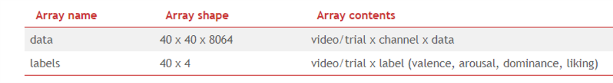
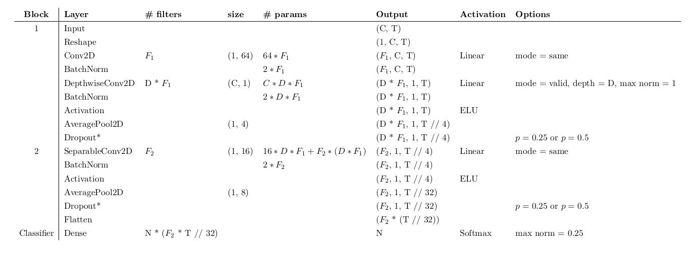
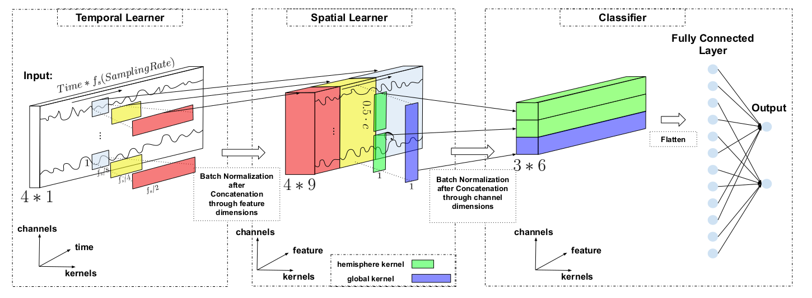

# Cognitive
## 进度条
- baseline
- EGGNet
- TSception
- visdom可视化

## 使用说明
- models : 存放写好了的网络模型或者其他模型
- utils:工具和配置
	- options:全局配置
	- utils:工具， 包括:加载数据，训练，保存和加载权重，etc
- methods:方法， baseline, etc
- datasets:
  - data:存放数据
  - *.oy:处理数据


## 数据

[DEAP ](http://www.eecs.qmul.ac.uk/mmv/datasets/deap/index.html)

被试：32名（16名男性和16名女性）；

EEG电极：10-20国际标准的32导联电极帽；

采样率：512Hz;

在观看完1分钟的刺激视频后，被试按照从1～9的大小，标记所看视频的效价(Valence)、唤醒度(Arousal)、优势度(Dominance)和喜爱度(Liking)的大小。

常利用预处理(降采样128Hz，4-45Hz带通滤波，去除眼电)后的脑电数据。



## 网络结构

### EEGNet

from the paper: EEGNet: A Compact Convolutional Neural Network for EEG-based Brain-Computer Interfaces



### TSception

from the paper: TSception:A Deep Learning Framework for Emotion Detection Using EEG




## Examples

### 数据处理

```python
# for small data (40, 101)
python split.py --data_path ./data/small_data.npy

# for big data (40, 7680)
python split.py --data_path ./data/data.npy
```

得到

```
train_data.npy
train_label.npy
test_data.npy
test_label.npy
```


### 训练

1. 打开 visdom 
```
python -m visdom.server  port 8888
```

打开端口 8888

2. 运行
```python
# see the utils/options,py for more parameters 
python main.py --model basemodel --num_epochs 400
```

3. 打开浏览器 localhost:8888， 查看训练过程


### contact me 

- hichens@qq.com
- hichens1559576916@gmail.com